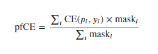
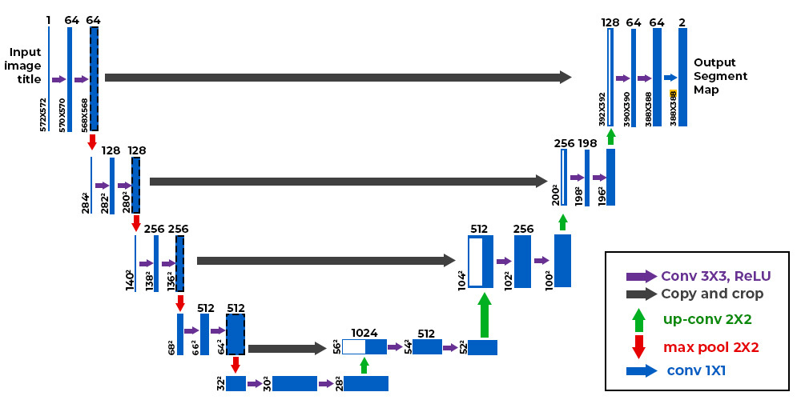

### **Note**: this is deep and detailed description (documentation) of a model training steps. 
#### Lets look at **Metric values** recorded after training model for 50 epochs:
## Best after 50 epochs of training:
**Accuracy**: 0.7853

**IOU(intersection-over-union)**: 0.7272

**Loss**: 0.5526

# Dataset: [Forest Aerial Images for Segmentation](https://www.kaggle.com/datasets/quadeer15sh/augmented-forest-segmentation)

**Content**: This dataset contains 5108 aerial images of dimensions 256x256

**Acknowledgements**: This dataset was obtained from Land Cover Classification Track in DeepGlobe Challenge- DeepGlobe 2018: A Challenge to Parse the Earth through Satellite Images.


# Detailed description (using Kaggle notebook):
### Main Libraries to install
```python
import random
import tensorflow as tf
from tensorflow import keras
```
- **random**: This module is used to generate random numbers. It's often used for creating random splits or for any other randomization tasks within the code.
- **tensorflow as tf**: TensorFlow is an open-source platform for machine learning. It includes a comprehensive, flexible ecosystem of tools, libraries, and community resources.
- **from tensorflow import keras**: Keras is a high-level neural networks API, written in Python and capable of running on top of TensorFlow. It simplifies building and training deep learning models.

### Data Imports
```python
import os
import pandas as pd
from glob import glob
import tensorflow.data as tfd
```
- **os**: This module provides a way of using operating system dependent functionality like reading or writing to the file system.
- **pandas as pd**: Pandas is a fast, powerful, flexible, and easy-to-use open-source data analysis and data manipulation library for Python.
- **from glob import glob**: The glob module finds all the pathnames matching a specified pattern according to the rules used by the Unix shell, although it works on Windows as well.
- **import tensorflow.data as tfd**: This imports the data module from TensorFlow, which provides utilities for working with data input pipelines.

### Data Visualization
```python
from PIL import Image
import plotly.express as px
import matplotlib.pyplot as plt
from IPython.display import Image as GIF
```
- **from PIL import Image**: PIL (Python Imaging Library) is a library that adds image processing capabilities to your Python interpreter. This module supports opening, manipulating, and saving many different image file formats.
- **import plotly.express as px**: Plotly Express is a high-level data visualization library in Python. It provides a concise, consistent, high-level interface for creating a wide range of interactive plots.
- **import matplotlib.pyplot as plt**: Matplotlib is a plotting library for the Python programming language and its numerical mathematics extension NumPy. pyplot is a module in matplotlib, which provides a MATLAB-like interface.
- **from IPython.display import Image as GIF**: This module is used to display images (like GIFs) directly in Jupyter Notebooks or IPython environments.

### U-Net Architecture
```python
from tensorflow.keras import layers
from tensorflow_examples.models.pix2pix import pix2pix
```
- **from tensorflow.keras import layers**: This imports the layers module from Keras, which includes the building blocks for neural networks (e.g., Dense, Conv2D, MaxPooling2D).
- **from tensorflow_examples.models.pix2pix import pix2pix**: This imports the pix2pix model from TensorFlow examples. pix2pix is an image-to-image translation with conditional adversarial networks, which can be adapted for tasks like image segmentation.


### Configuration for Data
```python
BATCH_SIZE = 16
IMAGE_SIZE = (128, 128)
IMAGE_DIRECTORY = "/kaggle/input/augmented-forest-segmentation/Forest Segmented/Forest Segmented/images/"
MASK_DIRECTORY = "/kaggle/input/augmented-forest-segmentation/Forest Segmented/Forest Segmented/masks/"
```
- **BATCH_SIZE = 16**: This sets the batch size to 16. A batch is a subset of the dataset used to train the model at one time. Smaller batch sizes use less memory but may take longer to train the model.
- **IMAGE_SIZE = (128, 128)**: This sets the target size for the images to be 128x128 pixels. All images will be resized to this dimension.
- **IMAGE_DIRECTORY**: This is the path to the directory where the input images are stored.
- **MASK_DIRECTORY**: This is the path to the directory where the segmentation masks corresponding to the input images are stored.

### Settings for Reproducibility
```python
SEED = 42
BATCH_SIZE = 32
VALIDATION_SIZE = 1000
AUTOTUNE = tfd.AUTOTUNE
tf.random.set_seed(SEED)
```
- **SEED = 42**: This sets a seed for random number generation to ensure reproducibility. Using the same seed will generate the same random numbers each time, which helps in getting consistent results across different runs.
- **BATCH_SIZE = 32**: This redefines the batch size to 32, which means that now the batch size will be 32 instead of the previously set 16.
- **VALIDATION_SIZE = 1000**: This sets the size of the validation dataset to 1000 samples.
- **AUTOTUNE = tfd.AUTOTUNE**: This sets the data loading to be autotuned, which means that TensorFlow will dynamically adjust the prefetch buffer size for better performance.
- **tf.random.set_seed(SEED)**: This sets the seed for TensorFlow's random number generators, ensuring reproducibility of the random operations within TensorFlow.

This section of the code ensures that data is properly configured and that the training process can be reproduced consistently by setting the random seed.

### `decode_image(file_path)`
```python
def decode_image(file_path):
    """
    Load and preprocess an image from the provided file path.

    Args:
        file_path (str): Path to the image file.

    Returns:
        tf.Tensor: The preprocessed image tensor.
    """
    image = tf.io.read_file(file_path)
    image = tf.image.decode_jpeg(image, channels=3)
    image = tf.image.convert_image_dtype(image, tf.float32)
    image = tf.image.resize(image, IMAGE_SIZE)
    image = tf.clip_by_value(image, clip_value_min=0.0, clip_value_max=1.0)
    return image
```
- **tf.io.read_file(file_path)**: Reads the image file from the given file path.
- **tf.image.decode_jpeg(image, channels=3)**: Decodes the JPEG image to a tensor, ensuring it has 3 color channels (RGB).
- **tf.image.convert_image_dtype(image, tf.float32)**: Converts the image to float32 data type, normalizing pixel values to the range [0, 1].
- **tf.image.resize(image, IMAGE_SIZE)**: Resizes the image to the target size specified by `IMAGE_SIZE`.
- **tf.clip_by_value(image, clip_value_min=0.0, clip_value_max=1.0)**: Clips the pixel values to ensure they are within the range [0, 1].
- **return image**: Returns the preprocessed image tensor.

### `decode_masks(file_path)`
```python
def decode_masks(file_path):
    """
    Load and preprocess a mask image from the given file path.

    Args:
        file_path (str): Path to the mask image file.

    Returns:
        tf.Tensor: The preprocessed mask image tensor.
    """
    mask_image = decode_image(file_path)
    mask_image = mask_image[:, :, :1]  # Retain only the first channel for binary masks
    return mask_image
```
- **mask_image = decode_image(file_path)**: Calls `decode_image` to load and preprocess the mask image.
- **mask_image[:, :, :1]**: Retains only the first channel (grayscale) for binary masks, as segmentation masks typically have a single channel.
- **return mask_image**: Returns the preprocessed mask image tensor.

### `show_image(image, title=None, alpha=1)`
```python
def show_image(image, title=None, alpha=1):
    """
    Display an image with an optional title and transparency.

    Args:
        image (tf.Tensor): The image tensor to display.
        title (str, optional): The title for the image. Defaults to None.
        alpha (float, optional): Transparency value of the image. Defaults to 1.
    """
    plt.imshow(image, alpha=alpha)
    plt.title(title)
    plt.axis('off')
```
- **plt.imshow(image, alpha=alpha)**: Displays the image with the specified transparency (`alpha`).
- **plt.title(title)**: Sets the title of the image (if provided).
- **plt.axis('off')**: Hides the axes for a cleaner display.

### `show_image_masks(dataset, n_rows=5, n_cols=3, figsize=(10, 15))`
```python
def show_image_masks(dataset, n_rows=5, n_cols=3, figsize=(10, 15)):
    """
    Display a grid of images and corresponding masks from a dataset.

    Args:
        dataset (tf.data.Dataset): The dataset containing image and mask pairs.
        n_rows (int, optional): Number of rows in the grid. Defaults to 5.
        n_cols (int, optional): Number of columns in the grid. Defaults to 3.
        figsize (tuple, optional): Size of the plot figure. Defaults to (10, 15).
    """
    images, masks = next(iter(dataset.take(1)))

    plt.figure(figsize=figsize)
    for i in range(1, (n_rows * n_cols) + 1, n_cols):
        plt.subplot(n_rows, n_cols, i)
        show_image(images[i], title="Aerial Imagery")

        plt.subplot(n_rows, n_cols, i + 1)
        show_image(masks[i], title="Image Mask")

        plt.subplot(n_rows, n_cols, i + 2)
        show_image(images[i])
        show_image(masks[i], alpha=0.5, title="Overlay")

    plt.show()
```
- **images, masks = next(iter(dataset.take(1)))**: Takes one batch from the dataset and retrieves the images and masks.
- **plt.figure(figsize=figsize)**: Creates a new figure with the specified size.
- **for i in range(1, (n_rows * n_cols) + 1, n_cols)**: Iterates over the grid positions to display the images and masks.
    - **plt.subplot(n_rows, n_cols, i)**: Selects the subplot position for the image.
    - **show_image(images[i], title="Aerial Imagery")**: Displays the image with the title "Aerial Imagery".
    - **plt.subplot(n_rows, n_cols, i + 1)**: Selects the subplot position for the mask.
    - **show_image(masks[i], title="Image Mask")**: Displays the mask with the title "Image Mask".
    - **plt.subplot(n_rows, n_cols, i + 2)**: Selects the subplot position for the overlay.
    - **show_image(images[i])**: Displays the image.
    - **show_image(masks[i], alpha=0.5, title="Overlay")**: Overlays the mask on the image with 50% transparency and the title "Overlay".
- **plt.show()**: Displays the figure with all subplots.

These functions handle loading, preprocessing, and visualizing the images and masks, which are crucial steps for image segmentation tasks.

### Loading the Metadata
```python
metadata = pd.read_csv("/kaggle/input/augmented-forest-segmentation/meta_data.csv")
```
- **metadata = pd.read_csv("/kaggle/input/augmented-forest-segmentation/meta_data.csv")**: This reads the CSV file containing metadata about the images and masks into a pandas DataFrame. The CSV file path is specified within the `read_csv` function.

### Updating the Image Paths
```python
metadata.image = metadata.image.apply(lambda file_name: f"{IMAGE_DIRECTORY}{file_name}")
```
- **metadata.image**: This accesses the 'image' column in the DataFrame.
- **apply(lambda file_name: f"{IMAGE_DIRECTORY}{file_name}")**: This applies a lambda function to each element in the 'image' column. The lambda function concatenates the `IMAGE_DIRECTORY` path with the file name to create the full path for each image file.

### Updating the Mask Paths
```python
metadata['mask'] = metadata['mask'].apply(lambda file_name: f"{MASK_DIRECTORY}{file_name}")
```
- **metadata['mask']**: This accesses the 'mask' column in the DataFrame.
- **apply(lambda file_name: f"{MASK_DIRECTORY}{file_name}")**: This applies a lambda function to each element in the 'mask' column. The lambda function concatenates the `MASK_DIRECTORY` path with the file name to create the full path for each mask file.

### Summary
- **metadata**: A DataFrame containing metadata about the images and masks.
- **metadata.image**: Column in the DataFrame that now contains the full paths to the image files.
- **metadata['mask']**: Column in the DataFrame that now contains the full paths to the mask files.

By updating the paths in the metadata DataFrame, you ensure that the code can accurately locate and load the image and mask files from their respective directories.


### Creating TensorFlow Datasets from Metadata
```python
image_files = tfd.Dataset.from_tensor_slices(metadata['image'])
mask_files = tfd.Dataset.from_tensor_slices(metadata['mask'])
```
- **tfd.Dataset.from_tensor_slices(metadata['image'])**: This creates a TensorFlow dataset from the 'image' column of the metadata DataFrame. Each element in the dataset corresponds to a file path for an image.
- **tfd.Dataset.from_tensor_slices(metadata['mask'])**: This creates a TensorFlow dataset from the 'mask' column of the metadata DataFrame. Each element in the dataset corresponds to a file path for a mask.

### Decoding Image and Mask Files
```python
images = image_files.map(decode_image)
masks = mask_files.map(decode_masks)
```
- **image_files.map(decode_image)**: This applies the `decode_image` function to each file path in the `image_files` dataset, converting the file paths into preprocessed image tensors.
- **mask_files.map(decode_masks)**: This applies the `decode_masks` function to each file path in the `mask_files` dataset, converting the file paths into preprocessed mask tensors.

### Combining Images and Masks into a Single Dataset
```python
dataset = tf.data.Dataset.zip((images, masks))
```
- **tf.data.Dataset.zip((images, masks))**: This combines the `images` and `masks` datasets into a single dataset where each element is a tuple containing an image tensor and its corresponding mask tensor.

### Preparing the Dataset for Training
```python
dataset = dataset.repeat(2).shuffle(1000).batch(BATCH_SIZE)
```
- **dataset.repeat(2)**: This repeats the dataset 2 times. This means that after reaching the end of the dataset, it will start again from the beginning, effectively doubling the number of samples.
- **dataset.shuffle(1000)**: This shuffles the dataset with a buffer size of 1000, ensuring that the data is mixed well. Shuffling is important for training as it prevents the model from learning the order of the data.
- **dataset.batch(BATCH_SIZE)**: This groups the dataset into batches of size `BATCH_SIZE` (32 in this case). Each batch will contain 32 image-mask pairs.

### Summary
- **image_files**: A TensorFlow dataset containing file paths for images.
- **mask_files**: A TensorFlow dataset containing file paths for masks.
- **images**: A TensorFlow dataset of preprocessed image tensors.
- **masks**: A TensorFlow dataset of preprocessed mask tensors.
- **dataset**: A TensorFlow dataset of tuples containing image and mask tensors, prepared for training with repetition, shuffling, and batching.

This process transforms the raw file paths in the metadata into a ready-to-use dataset for training a segmentation model, ensuring that the data is properly preprocessed, shuffled, and batched.


### Custom Data Augmentation Layer
```python
class Augment(layers.Layer):
    """
    Custom layer for data augmentation of images and masks.

    Args:
        seed (int): Random seed for reproducibility. Defaults to 42.
    """
    def __init__(self, seed=42):
        super().__init__()
        
        self.augment_images = tf.keras.Sequential([
            layers.RandomRotation(0.3, seed=seed),
            layers.RandomFlip(mode="horizontal", seed=seed),
        ])
        
        self.augment_masks = tf.keras.Sequential([
            layers.RandomRotation(0.3, seed=seed),
            layers.RandomFlip(mode="horizontal", seed=seed),
        ])
            
    def call(self, inputs, labels):
        """
        Apply data augmentation to images and masks.

        Args:
            inputs (tf.Tensor): Input images tensor.
            labels (tf.Tensor): Input masks tensor.

        Returns:
            tuple: Tuple containing augmented images and masks tensors.
        """
        inputs = self.augment_images(inputs)
        labels = self.augment_masks(labels)
        return inputs, labels
```
- **class Augment(layers.Layer)**: Defines a custom Keras layer for data augmentation. This layer will be used to apply random transformations to both images and masks.
- **def __init__(self, seed=42)**: Initializes the `Augment` layer with a random seed for reproducibility.
    - **super().__init__()**: Calls the initializer of the parent class (`layers.Layer`).
    - **self.augment_images**: A sequential model that applies a series of augmentations to images. Specifically, it applies random rotations and horizontal flips.
    - **self.augment_masks**: A sequential model that applies the same augmentations to masks.
- **def call(self, inputs, labels)**: Defines the forward pass of the layer.
    - **inputs = self.augment_images(inputs)**: Applies the image augmentations to the input images.
    - **labels = self.augment_masks(labels)**: Applies the mask augmentations to the input masks.
    - **return inputs, labels**: Returns the augmented images and masks as a tuple.

### Applying Data Augmentation
```python
# Apply data augmentation
augmented_ds = dataset.map(Augment(SEED)).cache().prefetch(AUTOTUNE)

# A quick look
show_image_masks(augmented_ds)
```
- **augmented_ds = dataset.map(Augment(SEED))**: Applies the `Augment` layer to the dataset using the `map` function. Each element in the dataset (a tuple of image and mask tensors) is passed through the `Augment` layer to apply the augmentations.
- **.cache()**: Caches the dataset in memory. This can improve performance by avoiding the need to reload the data from disk on each epoch.
- **.prefetch(AUTOTUNE)**: Prefetches the data to improve performance by overlapping data preprocessing and model execution. `AUTOTUNE` allows TensorFlow to dynamically tune the prefetch buffer size for optimal performance.
- **show_image_masks(augmented_ds)**: Displays a grid of augmented images and their corresponding masks using the `show_image_masks` function defined earlier. This provides a visual check to ensure that the augmentations are applied correctly.

### Summary
- **Augment class**: A custom Keras layer that applies random rotations and horizontal flips to both images and masks for data augmentation.
- **augmented_ds**: The dataset with applied augmentations, cached in memory, and prefetched for improved performance.
- **show_image_masks**: A function call to visualize the augmented images and masks.

This setup helps in increasing the diversity of the training data through augmentations, which can improve the generalization capability of the model.

### Splitting into Training and Validation Sets
```python
valid_ds = augmented_ds.take(VALIDATION_SIZE//BATCH_SIZE).prefetch(AUTOTUNE)
train_ds = augmented_ds.skip(VALIDATION_SIZE//BATCH_SIZE).prefetch(AUTOTUNE)
```
- **valid_ds**: This creates a validation dataset by taking the first `VALIDATION_SIZE // BATCH_SIZE` batches from `augmented_ds`. This dataset is prefetched to improve performance.
- **train_ds**: This creates a training dataset by skipping the first `VALIDATION_SIZE // BATCH_SIZE` batches from `augmented_ds` and taking the rest. This dataset is also prefetched for performance.

### Calculating Number of Samples
```python
train_samples = tfd.experimental.cardinality(train_ds).numpy() * BATCH_SIZE
valid_samples = tfd.experimental.cardinality(valid_ds).numpy() * BATCH_SIZE
```
- **tfd.experimental.cardinality(train_ds).numpy()**: Calculates the number of batches in the `train_ds` dataset.
- **tfd.experimental.cardinality(valid_ds).numpy()**: Calculates the number of batches in the `valid_ds` dataset.
- **train_samples = ... * BATCH_SIZE**: Computes the total number of training samples by multiplying the number of batches by `BATCH_SIZE`.
- **valid_samples = ... * BATCH_SIZE**: Computes the total number of validation samples by multiplying the number of batches by `BATCH_SIZE`.

### Printing the Results
```python
print("Training   Samples:", train_samples)
print("Validation Samples:", valid_samples)
```
- Prints the total number of training and validation samples.

### Summary
- **valid_ds**: Dataset for validation, taken from the augmented dataset.
- **train_ds**: Dataset for training, excluding the validation dataset.
- **train_samples**: Total number of training samples.
- **valid_samples**: Total number of validation samples.

This approach ensures that the augmented dataset is split into training and validation sets, and it calculates the number of samples in each set, which is useful for monitoring and validating the training process.

### Loading the Base Model (MobileNetV2)
```python
base_model = keras.applications.MobileNetV2(
    input_shape=(*IMAGE_SIZE, 3),
    include_top=False
)
```
- **keras.applications.MobileNetV2**: Loads the MobileNetV2 model pretrained on ImageNet.
- **input_shape=(*IMAGE_SIZE, 3)**: Specifies the input shape of the model. `*IMAGE_SIZE` unpacks the tuple `(128, 128)` to `(128, 128)`.
- **include_top=False**: Excludes the fully connected layers at the top of the MobileNetV2, which are typically used for classification. This allows the model to be used as a feature extractor.

### Selecting Activation Layers for Encoder
```python
layer_names = [
    'block_1_expand_relu',   # 64x64
    'block_3_expand_relu',   # 32x32
    'block_6_expand_relu',   # 16x16
    'block_13_expand_relu',  # 8x8
    'block_16_project',      # 4x4
]

base_model_outputs = [base_model.get_layer(name).output for name in layer_names]
```
- **layer_names**: List of layer names from MobileNetV2 whose activations will be used for feature extraction.
- **base_model.get_layer(name).output for name in layer_names**: Retrieves the output tensors of the specified layers from the `base_model`.

### Creating the Encoder Model
```python
encoder = keras.Model(
    inputs=base_model.input,
    outputs=base_model_outputs,
    name="Encoder"
)
```
- **keras.Model**: Constructs a Keras model using functional API.
- **inputs=base_model.input**: Sets the input layer of the encoder model to match the input layer of `base_model`.
- **outputs=base_model_outputs**: Sets the output layers of the encoder model to the activations retrieved earlier.
- **name="Encoder"**: Assigns a name to the encoder model.

### Freezing the Encoder Weights
```python
encoder.trainable = False
```
- Freezes the weights of the encoder model, preventing them from being updated during training. This is typically done when using pretrained models to keep their learned features intact.

### Summary
- **base_model**: MobileNetV2 pretrained on ImageNet, loaded without the fully connected layers.
- **layer_names**: Names of specific layers in MobileNetV2 whose activations will be used.
- **base_model_outputs**: List of output tensors from MobileNetV2 corresponding to the specified layer names.
- **encoder**: A Keras model (Encoder) constructed to output activations from MobileNetV2 up to the specified layers.
- **encoder.trainable = False**: Freezes the weights of the encoder model to preserve pretrained features.

This setup initializes the encoder model using MobileNetV2 and prepares it for feature extraction, ensuring that the weights remain frozen to retain the features learned from ImageNet during training.


### Decoder (Up-sampling Block)
```python
decoder = [
    pix2pix.upsample(512, 3),  # 4x4 -> 8x8
    pix2pix.upsample(256, 3),  # 8x8 -> 16x16
    pix2pix.upsample(128, 3),  # 16x16 -> 32x32
    pix2pix.upsample(64, 3),   # 32x32 -> 64x64
]
```
- **pix2pix.upsample**: This function creates an upsampling layer (transposed convolution) with specified parameters.
- **Arguments**:
  - **512, 256, 128, 64**: Number of filters for each upsampling layer, which gradually reduces as the spatial dimensions increase.
  - **3**: Kernel size (3x3) for the transposed convolution, which defines the size of the filters used for upsampling.

### Explanation
- **Upsampling Layers**: Each `pix2pix.upsample` call creates a transposed convolutional layer that upsamples the spatial dimensions of its input.
- **Purpose**: The decoder's role in U-Net architectures is to progressively upsample the low-resolution feature maps provided by the encoder back to the original input image resolution, while also integrating skip connections to retain high-resolution details.

### Usage in U-Net
In a typical U-Net architecture:
- **Encoder**: Extracts features at multiple scales through downsampling.
- **Decoder**: Recovers spatial information by upsampling and integrating features from corresponding encoder layers (skip connections).

### Summary
The `decoder` list initializes a sequence of upsampling layers essential for reconstructing the high-resolution output in a U-Net model. Each `pix2pix.upsample` layer helps to progressively restore the spatial dimensions lost during the encoding process, facilitating accurate segmentation outputs.


# Task 1: Partial Cross Entropy

To implement a partial cross entropy loss function for your segmentation task, you can modify the standard binary cross entropy loss to consider only the labeled regions of interest (ROIs). Here’s how you can define it:



### Partial Cross Entropy Loss Function
```python
def partial_cross_entropy(y_true, y_pred, mask=None):
    """
    Compute partial cross entropy loss between true labels and predicted logits.

    Args:
        y_true (tf.Tensor): True labels (binary masks).
        y_pred (tf.Tensor): Predicted logits.
        mask (tf.Tensor, optional): Mask indicating labeled regions. Default is None.

    Returns:
        tf.Tensor: Partial cross entropy loss.
    """
    # Apply mask if provided
    if mask is not None:
        y_true = tf.where(mask > 0, y_true, tf.zeros_like(y_true))  # Apply mask to y_true

    # Compute sigmoid cross entropy loss
    loss = tf.reduce_mean(tf.nn.sigmoid_cross_entropy_with_logits(labels=y_true, logits=y_pred))

    return loss
```

### Explanation:
1. **Arguments**:
   - **y_true**: True labels (binary masks).
   - **y_pred**: Predicted logits from the model.
   - **mask** (optional): Mask indicating which regions are labeled. Only those regions will contribute to the loss calculation.

2. **Mask Handling**:
   - `if mask is not None`: Checks if a mask tensor is provided.
   - `tf.where(mask > 0, y_true, tf.zeros_like(y_true))`: Applies the mask to `y_true`, setting the values outside the labeled regions to zero. This ensures that the loss computation only considers the labeled regions defined by the mask.

3. **Loss Calculation**:
   - `tf.nn.sigmoid_cross_entropy_with_logits(labels=y_true, logits=y_pred)`: Computes the sigmoid cross entropy loss between `y_true` (possibly masked) and `y_pred`.

4. **Output**:
   - `tf.reduce_mean(...)`: Computes the mean loss across all elements in the batch, resulting in a scalar loss value.

### Usage:
- You can use this function directly as your loss function in TensorFlow/Keras when compiling your model for segmentation tasks.
- Ensure that when calling this function, `y_true` is the binary mask representing the ground truth, `y_pred` are the logits predicted by your model, and `mask` (if used) defines the regions of interest where the loss should be calculated.

This approach allows you to focus the loss calculation on specific regions of interest defined by the mask, which is crucial for tasks like semantic segmentation where not all pixels contribute equally to the loss. Adjust the mask handling based on your specific dataset and requirements.

If you want to annotate your `partial_cross_entropy` function with `@tf.function` to optimize it for TensorFlow's graph mode execution, here's how you can structure it while maintaining the flexibility to handle optional masks for partial cross entropy:

### Partial Cross Entropy Loss Function with `@tf.function`
```python
@tf.function
def partial_cross_entropy(y_true, y_pred, mask=None):
    """
    Compute partial cross entropy loss between true labels and predicted logits.

    Args:
        y_true (tf.Tensor): True labels (binary masks).
        y_pred (tf.Tensor): Predicted logits.
        mask (tf.Tensor, optional): Mask indicating labeled regions. Default is None.

    Returns:
        tf.Tensor: Partial cross entropy loss.
    """
    # Apply mask if provided
    if mask is not None:
        y_true = tf.where(mask > 0, y_true, tf.zeros_like(y_true))  # Apply mask to y_true

    # Compute sigmoid cross entropy loss
    loss = tf.reduce_mean(tf.nn.sigmoid_cross_entropy_with_logits(labels=y_true, logits=y_pred))

    return loss
```

### Explanation:
- **`@tf.function`**: This decorator converts the Python function into a TensorFlow graph operation, optimizing performance by compiling the function into a graph that can run efficiently on GPU or TPU.

- **Arguments**:
   - **`y_true`**: Tensor of true labels (binary masks).
   - **`y_pred`**: Tensor of predicted logits from the model.
   - **`mask` (optional)**: Tensor indicating which regions are labeled. Only these regions will contribute to the loss calculation.

- **Mask Handling**:
   - `if mask is not None`: Checks if a mask tensor is provided.
   - `tf.where(mask > 0, y_true, tf.zeros_like(y_true))`: Applies the mask to `y_true`, setting values outside the labeled regions to zero.

- **Loss Calculation**:
   - `tf.nn.sigmoid_cross_entropy_with_logits(labels=y_true, logits=y_pred)`: Computes the sigmoid cross entropy loss between `y_true` (possibly masked) and `y_pred`.

- **Output**:
   - `tf.reduce_mean(...)`: Computes the mean loss across all elements in the batch, resulting in a scalar loss value.

### Usage:
- This function can now be used directly as your loss function in TensorFlow/Keras models, and TensorFlow will handle the optimization of the function's execution.

- When invoking this function, ensure that `y_true` represents the ground truth binary masks, `y_pred` represents the logits predicted by your model, and `mask` (if used) defines the regions of interest where the loss should be calculated.

Using `@tf.function` optimizes the function for TensorFlow's execution graph, providing potential speedups in performance, especially during training and inference phases.

# Designing the U-net model


### Custom U-Net Model for Semantic Segmentation

```python
def CustomUNet(encoder_block, decoder_block, output_channels=1, **kwargs):
    """
    Custom U-Net model for semantic segmentation.

    Args:
        encoder_block (tf.keras.Model): Encoder block of the U-Net model.
        decoder_block (list): List of decoder blocks for the U-Net model.
        output_channels (int, optional): Number of output channels/classes. Defaults to 1.
        **kwargs: Additional keyword arguments passed to the base class constructor.

    Returns:
        tf.keras.Model: U-Net model for semantic segmentation.
    """
    # Input layer
    inputs = keras.Input(shape=(*IMAGE_SIZE, 3), name="ImageInput")

    # Pass it through the encoder
    encodings = encoder_block(inputs)
    skips = reversed(encodings[:-1])        
    encoding = encodings[-1]

    # Upsampling and Skip connections
    for index, (up, skip) in enumerate(zip(decoder_block, skips)):
        encoding = up(encoding)
        encoding = layers.Concatenate(name=f"ConCat-{index+1}")([encoding, skip])

    # The Output layer
    mask_out = layers.Conv2DTranspose(
        filters=output_channels,
        kernel_size=3,
        strides=2,
        padding="same",
    )(encoding)
    
    mask_out = layers.Conv2D(
        filters=output_channels,
        kernel_size=1,
        padding="same",
        activation='sigmoid',
        name="MaskOut"
    )(mask_out)

    # Define the model
    model = keras.Model(inputs, mask_out, **kwargs)
    
    return model
```

### Explanation:

1. **Arguments**:
   - **`encoder_block`**: Encoder block (typically MobileNetV2 in your case) that extracts features from the input images.
   - **`decoder_block`**: List of decoder blocks which consist of upsampling layers (e.g., transposed convolutions) combined with skip connections.
   - **`output_channels`**: Number of output channels/classes. Default is 1, suitable for binary segmentation tasks.
   - **`**kwargs`**: Additional keyword arguments passed to the base class constructor of `tf.keras.Model`.

2. **Input Layer**:
   - `inputs = keras.Input(shape=(*IMAGE_SIZE, 3), name="ImageInput")`: Defines the input layer for the model, expecting images of size `(128, 128, 3)`.

3. **Encoder**:
   - `encodings = encoder_block(inputs)`: Passes the input through the encoder block (MobileNetV2), producing feature maps at multiple scales.
   - `skips = reversed(encodings[:-1])`: Extracts skip connections from the encoder outputs, excluding the last one (highest resolution).

4. **Decoder (Upsampling and Skip Connections)**:
   - Iterates through `decoder_block` and `skips`, performing upsampling (using transposed convolutions) and concatenating skip connections to recover spatial details.

5. **Output Layer**:
   - `mask_out = layers.Conv2DTranspose(...)`: Upsamples the final decoder output to the original input image resolution.
   - `mask_out = layers.Conv2D(...)`: Applies a 1x1 convolution to generate the final segmentation mask, with `sigmoid` activation to output probabilities.

6. **Model Definition**:
   - `model = keras.Model(inputs, mask_out, **kwargs)`: Defines the Keras model using `inputs` (input layer) and `mask_out` (output layer).

### Usage:
- **Initialization**:
  ```python
  unet_model = CustomUNet(encoder_block=encoder, decoder_block=decoder, output_channels=1)
  ```
  - `encoder_block` should be an instance of the MobileNetV2 encoder.
  - `decoder_block` should be a list of upsampling layers (`decoder`) as defined earlier.

- **Output**:
  - `unet_model` is a Keras model ready for training or inference on your segmentation tasks, with the ability to handle images of size `(128, 128, 3)` and output a segmentation mask of the same size.

### Summary:
This function constructs a U-Net model tailored for semantic segmentation tasks, integrating a MobileNetV2 encoder with custom decoder blocks for upsampling and skip connections, culminating in a sigmoid-activated output layer for generating segmentation masks. Adjust the `output_channels` parameter based on the number of classes in your segmentation problem.

The `show_pred_masks` function and the `ShowImageMasksCallback` class are designed to visualize the predictions of a semantic segmentation model on a dataset. Let's review each component:

### `show_pred_masks` Function

```python
def show_pred_masks(dataset, model, n_rows=5, n_cols=6, figsize=(15, 15), savepath=None):
    """
    Display a grid of images, their true masks, and predicted masks from the given dataset using the provided model.

    Args:
        dataset (tf.data.Dataset): The dataset containing pairs of images and masks.
        model (tf.keras.Model): The trained model for predicting masks.
        n_rows (int, optional): Number of rows in the grid. Defaults to 5.
        n_cols (int, optional): Number of columns in the grid. Defaults to 6.
        figsize (tuple, optional): Figure size of the plot. Defaults to (15, 15).
        savepath (str, optional): Path to save the figure. Defaults to None.
    """
    images, masks = next(iter(dataset.take(1)))
    pred_masks = model.predict(images)

    plt.figure(figsize=figsize)
    for i in range(1, (n_rows * n_cols) + 1, n_cols):
        
        plt.subplot(n_rows, n_cols, i)
        show_image(images[i], title="Aerial Imagery")

        plt.subplot(n_rows, n_cols, i + 1)
        show_image(masks[i], title="True Image Mask")

        plt.subplot(n_rows, n_cols, i + 2)
        show_image(pred_masks[i], title="Predicted Image Mask")
        
        plt.subplot(n_rows, n_cols, i + 3)
        show_image(tf.cast(pred_masks[i]>=0.5, tf.float32), title="Processed Mask(0.5)")
        
        plt.subplot(n_rows, n_cols, i + 4)
        show_image(tf.cast(pred_masks[i]>=0.7, tf.float32), title="Processed Mask(0.7)")
        
        plt.subplot(n_rows, n_cols, i + 5)
        show_image(images[i])
        show_image(pred_masks[i], alpha=0.5, title="Overlapping")
        
        
    if savepath is not None:
        plt.savefig(savepath)
        
    plt.show()
```

### Explanation:

1. **Arguments**:
   - **`dataset`**: TensorFlow dataset containing pairs of images and masks.
   - **`model`**: Trained TensorFlow/Keras model used for predicting masks.
   - **`n_rows`**: Number of rows in the grid plot. Each row displays one image and its masks.
   - **`n_cols`**: Number of columns in the grid plot, controlling the number of images displayed per row.
   - **`figsize`**: Size of the plot figure.
   - **`savepath`**: Optional path to save the figure as an image file.

2. **Functionality**:
   - **Data Retrieval**: Retrieves a batch of images and true masks from the dataset.
   - **Prediction**: Uses the model to predict masks (`pred_masks`) for the batch of images.
   - **Visualization**: Iterates through the images and displays:
     - Original image (`Aerial Imagery`).
     - True mask (`True Image Mask`).
     - Predicted mask (`Predicted Image Mask`).
     - Thresholded masks at 0.5 and 0.7 (`Processed Mask(0.5)`, `Processed Mask(0.7)`).
     - Overlay of the original image with the predicted mask (`Overlapping`).

3. **Save Functionality**:
   - If `savepath` is provided, saves the plotted figure as an image file.

### `ShowImageMasksCallback` Class

```python
class ShowImageMasksCallback(keras.callbacks.Callback):
    """
    Callback to visualize the model's predicted masks on the validation dataset at the end of each epoch.

    Args:
        dataset (tf.data.Dataset): The validation dataset containing pairs of images and masks.
    """
    def __init__(self, dataset):
        super().__init__()
        self.dataset = dataset

    def on_epoch_end(self, epoch, logs=None):
        """
        Display the predicted masks on the validation dataset at the end of each epoch.

        Args:
            epoch (int): Current epoch number.
            logs (dict): Dictionary containing training metrics for the current epoch.
        """
        show_pred_masks(dataset=self.dataset, n_rows=3, model=self.model, savepath=f"ModelPred_Epoch_{epoch}.png", figsize=(15, 10))
```

### Explanation:

1. **Purpose**:
   - **`ShowImageMasksCallback`**: A Keras callback that visualizes the model's predicted masks on the validation dataset at the end of each training epoch.

2. **Initialization**:
   - **`__init__`**: Initializes the callback with a validation dataset (`self.dataset`).

3. **`on_epoch_end` Method**:
   - **`on_epoch_end`**: Callback method called at the end of each epoch during training.
   - **Arguments**:
     - **`epoch`**: Current epoch number.
     - **`logs`**: Dictionary containing training metrics for the current epoch.

4. **Functionality**:
   - **Visualization**: Uses the `show_pred_masks` function to display predictions (`n_rows=3`) made by `self.model` on `self.dataset`.
   - **Save Path**: Saves each visualization with a filename indicating the epoch number (`f"ModelPred_Epoch_{epoch}.png"`).

### Usage:
- **`show_pred_masks`** can be called directly to visualize predictions on any dataset with a trained model.
- **`ShowImageMasksCallback`** can be used as a callback during model training to monitor and visualize model performance on the validation set after each epoch.

These utilities are helpful for monitoring and debugging semantic segmentation models, providing visual feedback on predicted masks throughout the training process. Adjust parameters like `n_rows`, `n_cols`, and `figsize` based on your specific visualization needs.

The `calculate_iou` function computes the Intersection over Union (IoU), which is a common metric used to evaluate the performance of semantic segmentation models. Here’s a breakdown of how this function works:

### Intersection over Union (IoU) Calculation

```python
def calculate_iou(y_true, y_pred):
    # Assuming y_true and y_pred are binary masks
    y_true = tf.cast(y_true > 0.5, tf.float32)
    y_pred = tf.cast(y_pred > 0.5, tf.float32)
    
    # Intersection and Union calculation
    intersection = tf.reduce_sum(y_true * y_pred)
    union = tf.reduce_sum(tf.cast(y_true + y_pred > 0, tf.float32))
    
    # IoU calculation
    iou = intersection / (union + tf.keras.backend.epsilon())
    
    return iou
```

### Explanation:

1. **Input Parameters**:
   - **`y_true`**: Ground truth binary mask (tensor).
   - **`y_pred`**: Predicted binary mask (tensor).

2. **Data Preparation**:
   - **`tf.cast(y_true > 0.5, tf.float32)`**: Converts `y_true` and `y_pred` into binary masks, where values greater than 0.5 are considered foreground (1) and others are background (0).

3. **Intersection and Union Calculation**:
   - **`intersection`**: Computes the element-wise multiplication (`AND` operation) of `y_true` and `y_pred`, then sums all elements to get the total intersection area.
   - **`union`**: Computes the element-wise logical OR (`OR` operation) of `y_true` and `y_pred`, converts the result to float, and sums all elements to get the total union area.

4. **IoU Calculation**:
   - **`iou`**: Computes the Intersection over Union by dividing `intersection` by (`union + tf.keras.backend.epsilon()`), where `tf.keras.backend.epsilon()` is a small constant added to avoid division by zero.

5. **Return Value**:
   - Returns the computed IoU score as a tensor.

### Usage:
- **Binary Masks**: Ensure that `y_true` and `y_pred` are binary masks (values either 0 or 1).
- **Thresholding**: The function assumes a threshold of 0.5 for converting masks to binary form (`y_true > 0.5` and `y_pred > 0.5`).
- **Evaluation**: Typically used to evaluate the accuracy of semantic segmentation models alongside other metrics like accuracy and loss.

### Example:
```python
# Example usage
y_true = tf.constant([[0, 1], [1, 0]], dtype=tf.float32)
y_pred = tf.constant([[0, 1], [1, 1]], dtype=tf.float32)

iou_score = calculate_iou(y_true, y_pred)
print("IoU Score:", iou_score.numpy())
```

This function provides a straightforward way to compute IoU scores in TensorFlow/Keras, essential for evaluating the performance of your segmentation model during training or inference. Adjust the threshold (`0.5` in this case) based on your specific problem requirements.

# Training model

### Model Compilation

```python
# Model Compilation
model.compile(
    loss=partial_cross_entropy,
    optimizer=keras.optimizers.Adam(learning_rate=1e-3),
    metrics=['accuracy', calculate_iou]
)
```

- **Loss Function (`loss=partial_cross_entropy`)**: You've defined a custom loss function `partial_cross_entropy` which computes the partial cross-entropy for your segmentation task.
- **Optimizer (`optimizer=keras.optimizers.Adam(learning_rate=1e-3)`)**: Adam optimizer with a learning rate of `1e-3` is chosen, suitable for training deep neural networks.
- **Metrics (`metrics=['accuracy', calculate_iou']`)**: During training, the model will track accuracy and IoU (`calculate_iou`) as evaluation metrics.

### Training Configuration and Execution

```python
# Training Configs
steps_per_epoch = train_samples // BATCH_SIZE
train_ds = train_ds.repeat()

# Model Training
history = model.fit(
    train_ds,
    steps_per_epoch=steps_per_epoch,
    validation_data=valid_ds,
    epochs=50,
    callbacks=[ShowImageMasksCallback(valid_ds)]
)
```

- **`steps_per_epoch`**: Number of steps (batches) to yield from the dataset per epoch. Calculated based on the total number of training samples (`train_samples`) divided by batch size (`BATCH_SIZE`).
- **`train_ds.repeat()`**: Ensures the training dataset repeats indefinitely, allowing the model to train on the entire dataset over multiple epochs.
- **`model.fit()`**: Initiates the training process:
  - **`train_ds`**: Training dataset passed to `model.fit()` method.
  - **`validation_data=valid_ds`**: Validation dataset used to evaluate the model's performance at the end of each epoch.
  - **`epochs=50`**: Number of training epochs specified as `50`.
  - **`callbacks=[ShowImageMasksCallback(valid_ds)]`**: Callback function `ShowImageMasksCallback` used to visualize predicted masks on the validation dataset after each epoch.

### Next Steps:

- Ensure that your `train_ds` and `valid_ds` are correctly formatted TensorFlow datasets containing image-mask pairs.
- Monitor training progress using the provided callback to visualize predicted masks (`ShowImageMasksCallback`).
- Adjust hyperparameters (`learning_rate`, batch size, number of epochs) based on model performance and convergence.
- After training, evaluate the model's performance using metrics such as accuracy, IoU, and visual inspection of predicted masks.

# saving the model for future use

```python
print('saving model...')
model.save('aerial_forest_segment.h5')
print('model saved.')
```

- **`model.save('aerial_forest_segment.h5')`**: Saves the entire model to the file `aerial_forest_segment.h5` in the current directory.

- **Confirmation**: After saving, it prints `"model saved."` to indicate that the saving process was successful.

Remember, you can load this saved model later using `keras.models.load_model('aerial_forest_segment.h5')` to perform predictions or continue training without retraining from scratch.


# Future improvements:
Increasing the density (i.e., adding more layers) in the U-Net architecture can potentially improve the model's performance metrics such as accuracy and IoU, but it's not a guaranteed solution in all cases. Here are some considerations:

### Potential Benefits of Increasing Layer Density:

1. **Increased Representational Power**:
   - Adding more layers increases the model's capacity to learn complex patterns and features in the data, potentially leading to better performance.

2. **Feature Extraction**:
   - Deeper layers can capture more abstract and hierarchical features, which might be crucial for accurate segmentation, especially in complex scenes.

3. **Enhanced Spatial Context**:
   - More layers can provide a larger receptive field, allowing the model to consider a broader context when making pixel-level predictions, which can improve segmentation accuracy.

### Factors to Consider:

1. **Overfitting**:
   - Adding more layers increases the risk of overfitting, especially if the model complexity exceeds the complexity of the problem or the available training data.

2. **Computational Complexity**:
   - Deeper models require more computational resources (memory, training time), which might not always be feasible depending on your hardware and time constraints.

3. **Dataset Size and Complexity**:
   - The effectiveness of deeper architectures often depends on the size and complexity of the dataset. For smaller datasets or simpler tasks, simpler architectures might generalize better.

Considering these factors stated above, we can assume that model is doing well with Metrics value as mentioned of the start of the description. 


